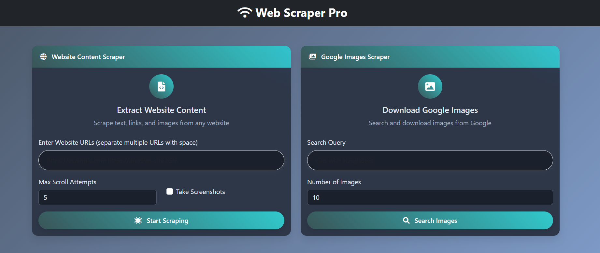

# Web Scraper Pro

A beautiful web-based frontend for Selenium-powered web scraping, featuring website content extraction and Google image search capabilities.



## Features

- **Website Content Scraper**: Extract text, links, and images from any website
  - Handle dynamic content with infinite scrolling support
  - Customizable scroll attempts
  - Screenshot capability
  - JSON export of results

- **Google Images Scraper**: Search and download images from Google
  - Specify number of images to download
  - Image gallery preview
  - Batch download as ZIP

- **Modern, Responsive UI**
  - Beautiful gradient design
  - Mobile-friendly interface
  - Dark mode support
  - Task history with local storage

## Installation

1. Clone this repository:
   ```
   git clone https://github.com/yourusername/web-scraper-pro.git
   cd web-scraper-pro
   ```

2. Create a virtual environment and activate it:
   ```
   python -m venv venv
   source venv/bin/activate  # On Windows: venv\Scripts\activate
   ```

3. Install dependencies:
   ```
   pip install -r requirements.txt
   ```

4. Make sure Chrome/Chromium is installed on your system (required for Selenium).

## Usage

1. Start the Flask server:
   ```
   python app.py
   ```

2. Open your browser and navigate to:
   ```
   http://localhost:5000
   ```

3. Use the Web Scraper Pro interface:
   - Enter website URLs to scrape content
   - Enter search queries to find and download images
   - View and download results

## Project Structure

```
web-scraper-pro/
├── app.py                 # Flask application
├── selenium_scraper/
│   └── script.py          # Selenium scraping logic
├── static/
│   ├── css/
│   │   └── styles.css     # Custom CSS styles
│   └── js/
│       └── script.js      # Frontend JavaScript
├── templates/
│   ├── index.html         # Main application page
│   ├── 404.html           # Error page
│   └── 500.html           # Error page
└── output/                # Storage for scraped data
    ├── images/            # Downloaded images
    ├── screenshots/       # Website screenshots
    └── debug/             # Debug information
```

## Requirements

- Python 3.6+
- Flask
- Selenium
- BeautifulSoup4
- Chrome/Chromium browser

See `requirements.txt` for the complete list of dependencies.

## How It Works

1. **Website Scraping**:
   - The Flask application receives URLs to scrape
   - Selenium WebDriver loads each page in Chrome
   - Dynamic content is handled by scrolling and waiting
   - BeautifulSoup extracts the content
   - Results are saved as JSON and can be downloaded

2. **Image Scraping**:
   - User enters a search query
   - Selenium navigates to Google Images
   - Images are clicked to get full-size versions
   - Images are downloaded and displayed in the gallery
   - Results can be downloaded individually or as a ZIP

## Contributing

Contributions are welcome! Please feel free to submit a Pull Request.

## License

This project is licensed under the MIT License - see the LICENSE file for details.

## Acknowledgments

- [Selenium](https://www.selenium.dev/) for browser automation
- [Flask](https://flask.palletsprojects.com/) for the web framework
- [Bootstrap](https://getbootstrap.com/) for the UI components 